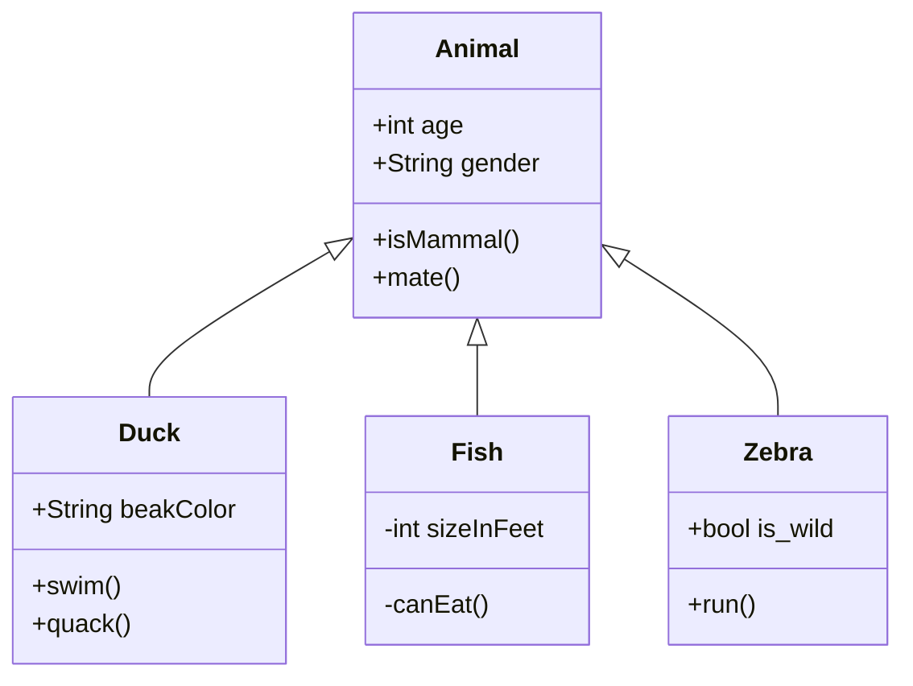

#### Консольная приложение "Планировщик задач"!

##### Описание модели

Задача: создать приложения "Планеровщик задач".

1)Задача имеет:

а)номер задачи
(уникальное число в рамках файла),

б)описание задачи
(строка не более 50 символов)

2)Меню содержит 5 варианта действий:

а)вывести список задач из файла
-Если в файле есть задачи, то выводятся все задачи из файла.
-Если в в файле нет задач, то выводится фраза "Список дел пуст".

б)добавить задачу(Ввод пользователем номера и описания задачи)
-Если в файле есть задача с таким номером, то вывод сообщения об Ошибке:
"Задача с таким номером уже существует.".
-Если в файле нет задачи с таким номером, то вывод сообщения об Успехе
и сохранение задачи в список задач.

в)редактировать описание задачи(Ввод пользователем номера и описания задачи)
-Если в файле есть задача с таким номером, то вывод сообщения об Успехе
и смена описание на новое.
-Если в файле нет задачи с таким номером, то вывод сообщения об Ошибке:
"Задачи с таким номером не существует".

г)удаление
-Если в файле есть задача с таким номером, то вывод сообщения об Успехе
и удаление задачи из списка задач.
-Если в файле нет задачи с таким номером, то вывод сообщения об Ошибке:
"Задачи с таким номером не существует".

д)выход из программы

Задача со звездочкой:

1)Использовать maven и сделать три проекта:
model(задача),
repository(работа с файлом),
service(логика работы с пользователем)-основной модуль

2)Использовать lombok
